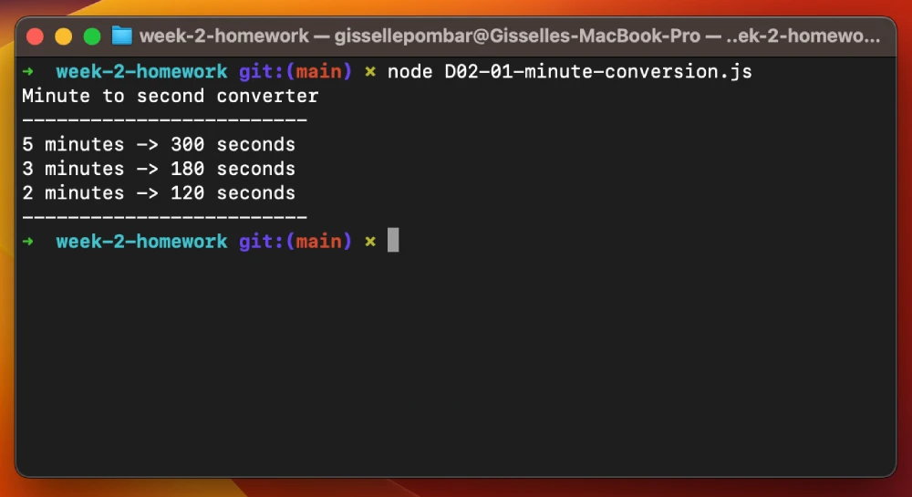

# Day 2: MySQL + JavaScript Homework Practice 
## 3) Creating Cuisine Table in Database

## Description 
    Create a SQL with your favorite dishes and cuisines.

## Elements
    MySQL

[Repo](https://github.com/gissellepombar/week2-homework/blob/main/D02-03-sql-cuisines.js)

## 2) Hour to Seconds Converter

## Description 
    Create a function that converts hours to seconds
    Ex) howManySeconds(2) ➞ 7200

## Elements
    Functions

[Repo](https://github.com/gissellepombar/week2-homework/blob/main/D02-02-hour-conversion.js)

## 1) Minute to Seconds Converter

## Description 
    Create a function that converts minutes to seconds
    Ex) Examples convert(5) ➞ 300

## Elements
    Functions

[Repo](https://github.com/gissellepombar/week2-homework/blob/main/D02-01-minute-conversion.js)
